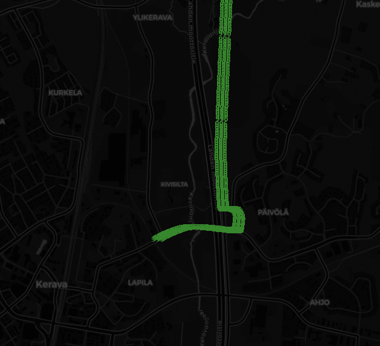
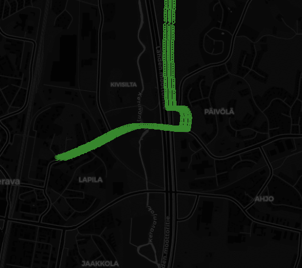

```bash
docker-compose up --build --remove-orphans --force-recreate console redpanda

docker-compose up --build --remove-orphans --force-recreate prometheus grafana
```

```bash
docker-compose up --build --remove-orphans --force-recreate producer
```

```bash
rpk topic delete filebeat

rpk topic create filebeat \
  --replicas 1 \
  --partitions 50 \
  --topic-config retention.ms=36000000 \
  --topic-config retention.bytes=-1
```



